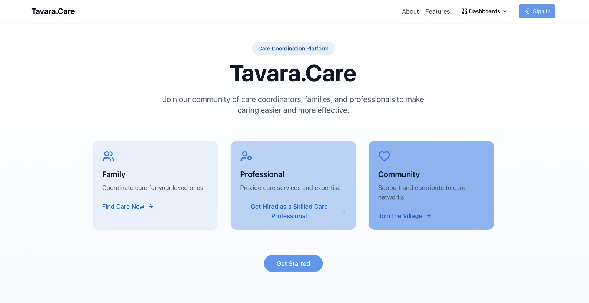

# Takes a Village

<div align="center">
  
  <p><em>Coordinating care shouldn't be complicated</em></p>
</div>

## Overview

Takes a Village is a modern web application designed to simplify care coordination among families, professional caregivers, and community volunteers. Our platform creates a centralized hub where everyone involved in providing care can connect, communicate, and collaborate effectively.

## Why Takes a Village?

Care coordination often involves juggling multiple caregivers, appointments, medications, and services. Our platform addresses these challenges by:

- **Centralizing Communication**: One place for all care-related discussions
- **Streamlining Coordination**: Easy scheduling and task management
- **Building Community**: Connecting families with local support resources
- **Enhancing Accessibility**: Role-specific interfaces for everyone involved

## Key Features

### For Families

- **Comprehensive Dashboard**: Manage all aspects of care in one place
- **Team Management**: Coordinate with professionals and volunteers
- **Appointment Scheduling**: Keep track of all healthcare visits
- **Meal Planning**: Organize nutritional needs and dietary preferences

### For Professionals

- **Client Management**: Efficiently track care for multiple families
- **Documentation Tools**: Maintain organized, accessible records
- **Schedule Optimization**: Balance time across different clients
- **Professional Development**: Access training resources

### For Community Members

- **Volunteer Opportunities**: Find ways to help local families
- **Resource Sharing**: Connect families with community resources
- **Event Coordination**: Organize community support activities

## Technology Stack

Takes a Village is built with modern web technologies:

- **Frontend**: React, TypeScript, Tailwind CSS, shadcn/ui
- **State Management**: React Context, TanStack Query
- **Backend**: Supabase (Authentication, Database, Storage)
- **UI/UX**: Responsive design with Framer Motion animations

## Security & Privacy

We prioritize the security and privacy of all users:

- **Role-Based Access Control**: Users only see information relevant to their role
- **Row-Level Security**: Database policies ensure proper data access
- **Secure Authentication**: Industry-standard auth practices
- **Data Encryption**: Protection at rest and in transit

## Project Status

Takes a Village is under active development with new features being added regularly. Visit our Features page to see what's coming next and vote on priorities.

## Getting Started

### For Users

1. Create an account based on your role (Family, Professional, or Community)
2. Complete your profile
3. Connect with your care network
4. Start using your personalized dashboard

### For Developers

1. Clone the repository
```bash
git clone <repository-url>
```

2. Install dependencies
```bash
npm install
```

3. Start the development server
```bash
npm run dev
```

## Contributing

We welcome contributions from developers of all skill levels! Please read our contributing guidelines before submitting pull requests.

## Support

Need help or have questions? Join our [Discord community](https://discord.com/channels/1119885301872070706/1280461670979993613) for support.

## License

This project is proprietary and confidential. All rights reserved.

## Technical Specifications

### Authentication & User Management

#### Technology Stack
- **Backend**: Supabase Authentication Service
- **Frontend**: React + TypeScript
- **State Management**: React Context API
- **Data Fetching**: TanStack Query

#### User Authentication
- **Authentication Method**: Email/password with JWT token-based session management
- **Session Handling**: Persistent sessions with automatic token refresh
- **Security Features**: CSRF protection, secure cookies, XSS prevention
- **Password Requirements**: Minimum 8 characters with complexity requirements

#### User Registration
- **Registration Flow**: Role-based multi-step registration forms
- **Available Roles**: Family, Professional, Community, Admin
- **Profile Data**: Role-specific fields with validation
- **Email Verification**: Optional verification with Supabase email templates

#### Role-Based Access Control
- **Role Definition**: Roles stored in dedicated profiles table with Supabase RLS
- **Authorization**: Row-Level Security policies based on user role and ID
- **Navigation Guards**: Client-side route protection with requireAuth hook
- **Admin Controls**: Separate admin dashboard with user management capabilities

#### Data Security
- **Database Security**: Supabase Row-Level Security (RLS) policies
- **API Security**: JWT validation for all authenticated requests
- **Storage Security**: Secured file access with role-based permissions
- **Profile Data**: Encrypted secure fields for sensitive information

### Feature Upvoting System

#### Technology Stack
- **Database**: Supabase PostgreSQL tables for features and votes
- **State Management**: Local React state + TanStack Query for caching
- **Real-time Updates**: Supabase subscriptions for live vote counts

#### Implementation Details
- **Feature Storage**: Dedicated features and feature_upvotes tables
- **Vote Handling**: One vote per user per feature with toggle capability
- **Data Relations**: User-to-votes relation with proper foreign keys
- **Cache Invalidation**: Optimistic UI updates with fallback error handling

### Deployment & DevOps

#### CI/CD Pipeline
- **Continuous Integration**: GitHub Actions for automated testing
- **Continuous Deployment**: Vercel integration with preview deployments
- **Code Quality**: ESLint, Prettier, TypeScript strict mode
- **Testing**: Jest and React Testing Library

#### Environment Configuration
- **Development**: Local Supabase instance with .env.local configuration
- **Staging**: Preview deployments with isolated Supabase staging project
- **Production**: Production Supabase instance with enhanced security

#### Infrastructure
- **Hosting**: Vercel for frontend, Supabase for backend
- **CDN**: Vercel Edge Network for static assets
- **Database**: Supabase PostgreSQL with automated backups
- **File Storage**: Supabase Storage for user uploads and media

### Performance Optimization

- **Bundle Optimization**: Code splitting, tree shaking, dynamic imports
- **Image Optimization**: Responsive images, WebP format, lazy loading
- **Caching Strategy**: TanStack Query with stale-while-revalidate pattern
- **API Efficiency**: Batched requests, query optimization, minimal payloads

### Monitoring & Analytics

- **Error Tracking**: Sentry integration for frontend and backend errors
- **Performance Monitoring**: Vercel Analytics for core web vitals
- **Usage Analytics**: Anonymous event tracking for feature usage
- **Logging**: Structured logging with severity levels and context

### Package Development & Reusability

#### Modular Architecture
- **Component Library**: Standalone UI component library with Storybook documentation
- **Hook Library**: Collection of reusable React hooks for auth, data fetching, and form handling
- **Context Providers**: Configurable context providers with dependency injection
- **TypeScript Types**: Shared type definitions across packages and applications

#### Package Distribution
- **GitHub Packages**: Private npm registry for organization-wide access
- **Versioning Strategy**: Semantic versioning with automated release notes
- **Documentation**: Auto-generated API documentation and usage examples
- **Changelog**: Automated changelog generation from commit messages

#### Integration Strategies
- **Framework Agnostic Core**: Core logic separated from UI for cross-framework support
- **Plugin System**: Extensible plugin architecture for custom authentication providers
- **Theming Support**: Design token system for consistent styling across applications
- **i18n Integration**: Built-in internationalization support for multi-language deployments

#### Compatibility & Standards
- **Accessibility**: WCAG 2.1 AA compliance with automated testing
- **Browser Support**: Compatibility with modern browsers and graceful degradation
- **Mobile Responsiveness**: Responsive design patterns and touch-friendly interactions
- **API Standards**: RESTful API design principles and OpenAPI documentation
